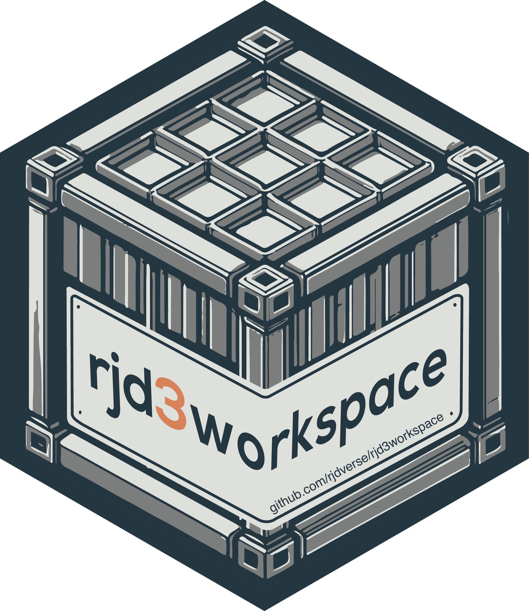

<!-- README.md is generated from README.Rmd. Please edit that file -->

# `rjd3workspace` <a href="https://rjdverse.github.io/rjd3workspace/"></a>

<!-- badges: start -->

[](https://CRAN.R-project.org/package=rjd3workspace)

[](https://github.com/rjdverse/rjd3workspace/actions/workflows/R-CMD-check.yaml)
[](https://github.com/rjdverse/rjd3workspace/actions/workflows/lint.yaml)

[](https://github.com/rjdverse/rjd3workspace/actions/workflows/pkgdown.yaml)
<!-- badges: end -->

**rjd3workspace** offers several functions to wrangle JDemetra+ v3.x
workspaces.

Seasonal adjustment with X-12ARIMA can be done with the package
[**rjd3x13**](https://github.com/rjdverse/rjd3x13) and with TRAMO-SEATS
with the package
[**rjd3tramoseats**](https://github.com/rjdverse/rjd3tramoseats).

## Installation

**rjd3workspace** relies on the
[**rJava**](https://CRAN.R-project.org/package=rJava) package

Running rjd3 packages requires **Java 17 or higher**. How to set up such
a configuration in R is explained
[here](https://jdemetra-new-documentation.netlify.app/#Rconfig)

### Latest release

To get the current stable version (from the latest release):

- From GitHub:

``` r
# install.packages("remotes")
remotes::install_github("rjdverse/rjd3toolkit@*release")
remotes::install_github("rjdverse/rjd3tramoseats@*release")
remotes::install_github("rjdverse/rjd3x13@*release")
remotes::install_github("rjdverse/rjd3providers@*release")
remotes::install_github("rjdverse/rjd3workspace@*release")
```

- From [r-universe](https://rjdverse.r-universe.dev/rjd3workspace):

``` r
install.packages("rjd3workspace", repos = c("https://rjdverse.r-universe.dev", "https://cloud.r-project.org"))
```

### Development version

You can install the development version of **rjd3workspace** from
[GitHub](https://github.com/) with:

``` r
# install.packages("remotes")
remotes::install_github("rjdverse/rjd3workspace")
```

## Usage

``` r
library("rjd3workspace")

dir <- tempdir()

y <- rjd3toolkit::ABS$X0.2.09.10.M
jws <- .jws_new()
jsap1 <- .jws_sap_new(jws, "sa1")
add_sa_item(jsap1, name = "x13", x = rjd3x13::x13(y))
add_sa_item(jsap1, name = "tramo", x = rjd3tramoseats::tramoseats(y))
save_workspace(jws, file.path(dir, "ws.xml"))

jws <- .jws_load(file = file.path(dir, "ws.xml"))
.jws_compute(jws) # to compute the models
jsap1 <- .jws_sap(jws, idx = 1) # first SAProcessing
jsa1 <- .jsap_sa(jsap1, idx = 1) # first SAItem
.jsa_name(jsa1)
#> [1] "x13"
mod1 <- .jsa_read(jsa1)
```

### Create SA-item with path

``` r
# install.packages("remotes")
# remotes::install_github("rjdverse/rjd3providers")

dir <- tempdir()

xlsx_file <- paste0(system.file("examples", package="rjd3providers"), "/Insee.xlsx")
ts1 <- rjd3providers::spreadsheet_series(file = xlsx_file, sheet = 1L, series = 3L)

y <- ts1$data
jws <- .jws_new()
jsap1 <- .jws_sap_new(jws, "sa1")
add_sa_item(jsap1, name = "x13", x = rjd3x13::x13(y))
rjd3workspace::set_ts(jsap = jsap1, idx = 1L, y = ts1)
add_sa_item(jsap1, name = "tramo", x = rjd3tramoseats::tramoseats(y))
rjd3workspace::set_ts(jsap = jsap1, idx = 2L, y = ts1)

save_workspace(jws, file.path(dir, "ws.xml"))

jws <- .jws_load(file = file.path(dir, "ws.xml"))
.jws_compute(jws) # to compute the models
jsap1 <- .jws_sap(jws, idx = 1) # first SAProcessing
jsa1 <- .jsap_sa(jsap1, idx = 1) # first SAItem
.jsa_name(jsa1)
#> [1] "x13"
mod1 <- .jsa_read(jsa1)
```

## Package Maintenance and contributing

Any contribution is welcome and should be done through pull requests
and/or issues. pull requests should include **updated tests** and
**updated documentation**. If functionality is changed, docstrings
should be added or updated.

## Licensing

The code of this project is licensed under the [European Union Public
Licence
(EUPL)](https://joinup.ec.europa.eu/collection/eupl/eupl-text-eupl-12).
